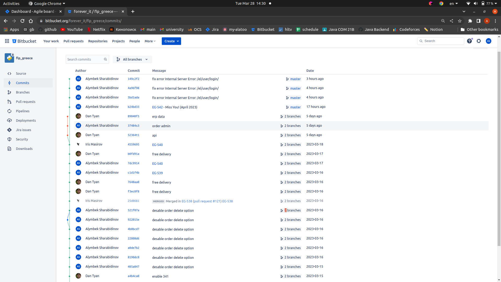
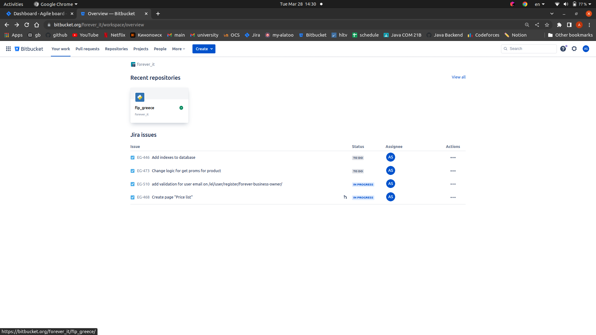
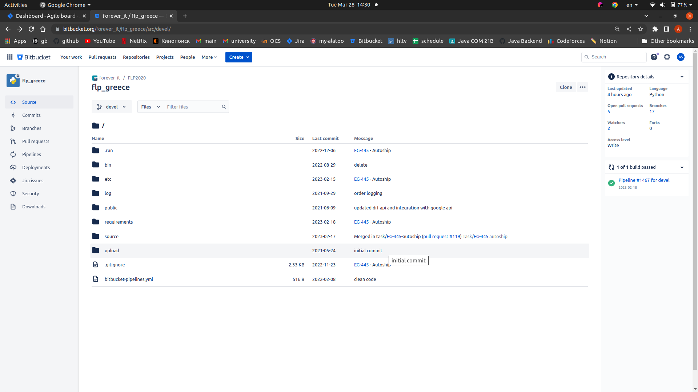
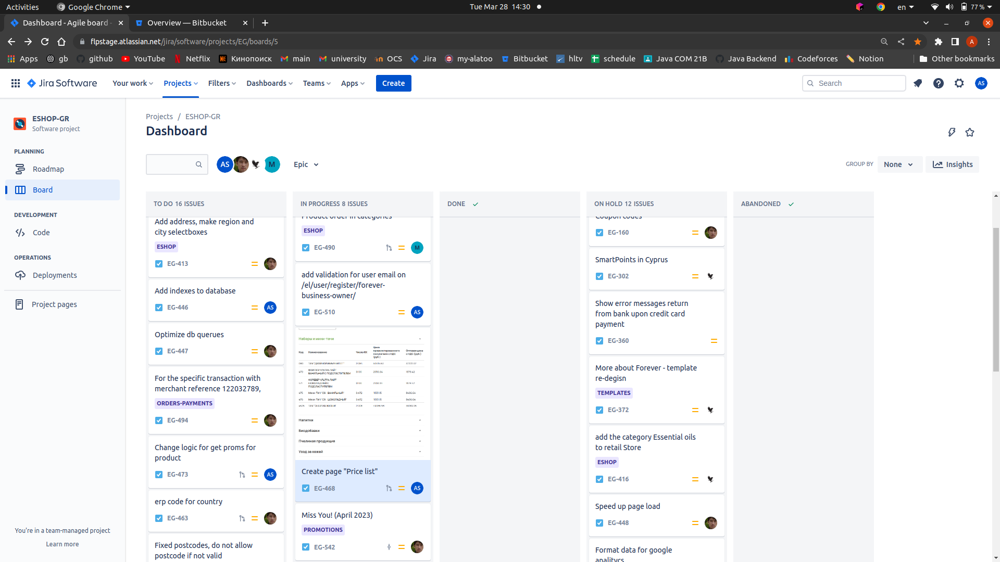
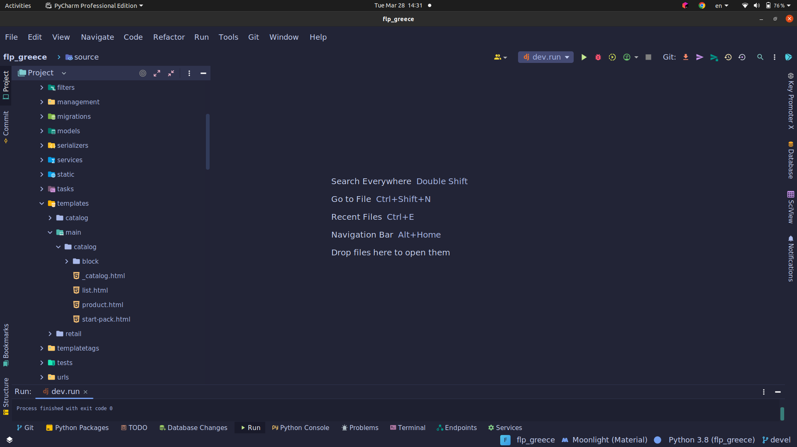
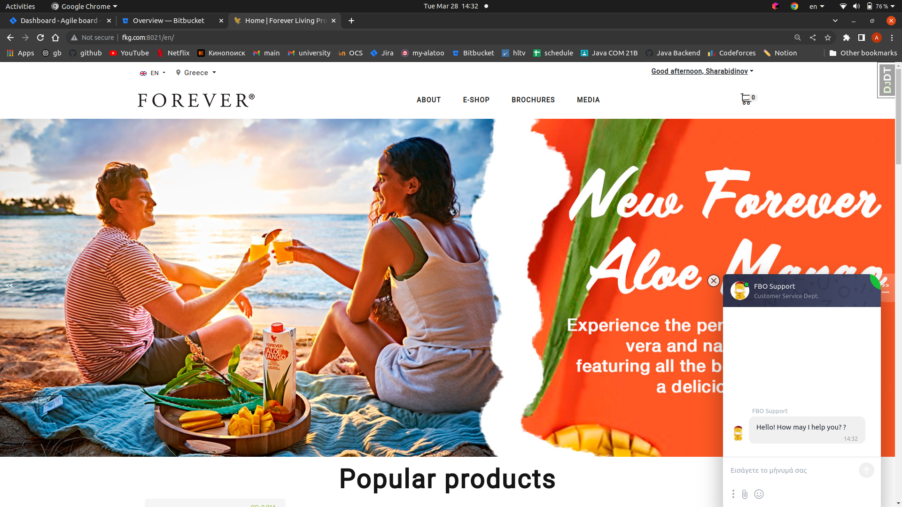

# web-midterm-alymbek-sharabidinov


## Description
LInk: [FLP Greece](https://www.foreverliving.gr/en/) (it's deployed on companies own server)

Forever Living Products online store that allows customers to purchase high-quality 
health and wellness products from Forever Living, a leading company in the health and beauty industry.
(generated by chatgpt😊)

### dependencies
> requirements
```
amqp==5.0.9
asgiref==3.6.0
astroid==2.9.3
asttokens==2.0.5
attrs==21.4.0
automium==0.2.6
automium-web==0.1.1
backcall==0.2.0
backports.zoneinfo==0.2.1
beautifulsoup4==4.10.0
better-exceptions==0.3.3
billiard==3.6.4.0
black==21.12b0
bs4==0.0.1
cached-property==1.5.2
celery==5.2.7
celery-once==3.0.1
certifi==2021.10.8
cffi==1.15.0
charset-normalizer==2.0.10
click==8.0.3
click-didyoumean==0.3.0
click-plugins==1.1.1
click-repl==0.2.0
common==0.1.2
coreapi==2.3.3
coreschema==0.0.4
cron-descriptor==1.2.35
cryptography==36.0.1
decorator==5.1.1
Django==4.1.7
django-admin-rangefilter==0.9.0
django-appconf==1.0.5
django-braces==1.15.0
django-celery-beat==2.5.0
django-celery-results==2.4.0
django-ckeditor==6.2.0
django-compressor==4.3.1
django-cors-headers==3.13.0
django-debug-toolbar==3.2.4
django-debug-toolbar-template-timings==0.9
django-environ==0.9.0
django-extensions==3.2.1
django-filter==22.1
django-imagekit==4.1.0
django-js-asset==1.2.2
django-json-widget==1.1.1
django-modeladmin-reorder==0.3.1
django-modeltranslation==0.18.9
django-phonenumber-field==7.0.2
django-redis==5.2.0
django-rest-knox==4.2.0
django-rest-passwordreset==1.2.1
django-split-settings==1.2.0
django-static-sitemaps==4.7.0
django-timezone-field==5.0
django-user-agents==0.4.0
django-widget-tweaks==1.4.12
djangorestframework==3.12.0
djangorestframework-camel-case==1.1.2
drf-yasg==1.20.0
et-xmlfile==1.1.0
executing==0.8.2
Faker==11.3.0
flake8==4.0.1
Flask==2.0.2
fontawesomefree==6.0.0
future==0.18.2
graphviz==0.20.1
gunicorn==20.1.0
h11==0.13.0
httptools==0.3.0
idna==3.3
inflection==0.5.1
ipython==8.0.1
isodate==0.6.1
isort==5.10.1
itsdangerous==2.0.1
itypes==1.2.0
jedi==0.18.1
Jinja2==3.0.3
kombu==5.2.3
lazy-object-proxy==1.7.1
legacy==0.1.6
loguru==0.5.3
lxml==4.9.2
MarkupSafe==2.0.1
matplotlib-inline==0.1.3
mccabe==0.6.1
mypy-extensions==0.4.3
numpy==1.22.1
openpyxl==3.0.9
packaging==21.3
pandas==1.4.0
parso==0.8.3
pathspec==0.9.0
pdfrw==0.4
pexpect==4.8.0
phonenumbers==8.12.41
pickleshare==0.7.5
pilkit==2.0
Pillow==9.4.0
platformdirs==2.4.1
prompt-toolkit==3.0.24
psycopg2-binary==2.9.5
ptyprocess==0.7.0
pure-eval==0.2.2
pycodestyle==2.8.0
pycparser==2.21
pycryptodome==3.9.8
pydot==1.4.2
pyflakes==2.4.0
Pygments==2.11.2
pylint==2.12.2
pyparsing==3.0.7
python-crontab==2.6.0
python-dateutil==2.8.2
pytz==2021.3
PyYAML==6.0
rcssmin==1.1.1
redis==3.5.3
requests==2.28.2
requests-file==1.5.1
requests-toolbelt==0.9.1
rjsmin==1.2.1
ruamel.yaml==0.17.20
ruamel.yaml.clib==0.2.6
sentry-sdk==1.5.3
six==1.16.0
soupsieve==2.3.1
sqlparse==0.4.2
stack-data==0.1.4
stripe==5.3.0
text-unidecode==1.3
toml==0.10.2
tomli==1.2.3
tqdm==4.62.3
traitlets==5.1.1
transliterate==1.10.2
typing_extensions==4.0.1
tzdata==2023.2
ua-parser==0.16.1
Unidecode==1.3.6
uritemplate==4.1.1
urllib3==1.26.8
user-agents==2.2.0
uvicorn==0.17.0
uvloop==0.16.0
views==0.3
vine==5.0.0
wcwidth==0.2.5
Werkzeug==2.0.2
wrapt==1.13.3
xlrd==2.0.1
xlwt==1.3.0
xmltodict==0.13.0
zeep==4.2.1
```

## database type and ERD image
You can find erd image in img directory
```
from django.db import connection
print(connection.vendor)

postgresql
```


# Commit history and screenshots


__apps located in core direcotry__




__runed on local server__


